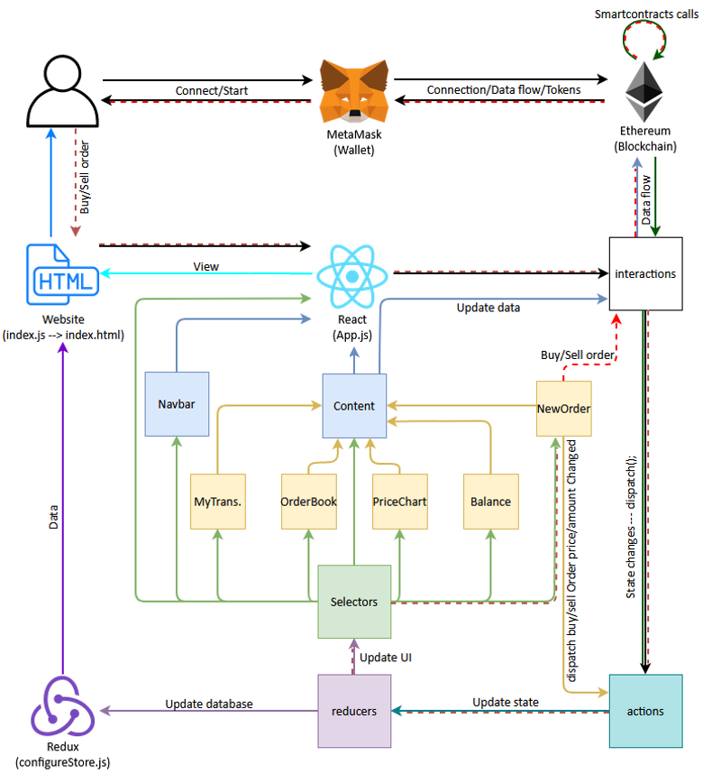

# Dex Exchange 
  underconstruction....

  

## Flow Chart

## TODO
- [ ] Finish README.md with overview of project
- [ ] clean up TODO items in code
- [ ] pull price data from link oracles
- [ ] create a matching engine for autofilling orders

