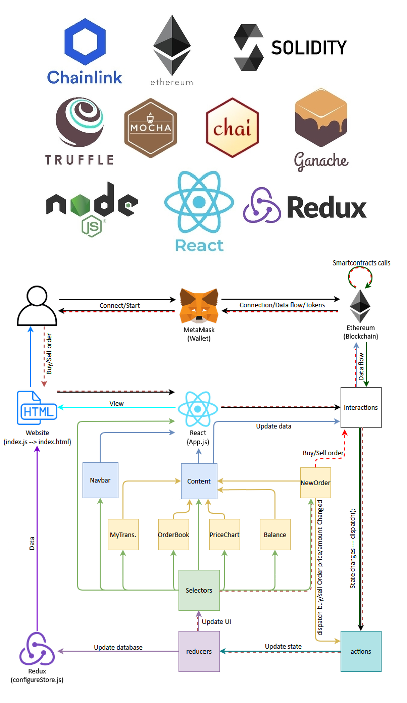

# Decentralized Exchange 
  While this project was more for educational purposes then actually a product meant for deployment, I would like to add a matching engine to the
  Dex to expand its functionality and make it more realistic. In order to trade using this Dex, you have to click on specific orders in the orderbook 
  to trade.  There is nothing that stops the orderbook from crossing markets (ie. a limit order submission will not fill even if your limit order is 
  through the current best bid/ask).

  Below is a flow chart of the general architecture of the Dex and how it was built.  There is a fair amount of frameworks used in the making
  of the DAPP.  They are outlined below.  The 'ganache' branch is the set of code that was used for development where as the 'master' branch is
  used for deployment on the rinkeby testnet.  

## TODO
- [ ] Finish README.md with overview of project 
- [ ] clean up TODO items in code
- [ ] pull price data from link oracles
- [ ] create a matching engine for autofilling orders

